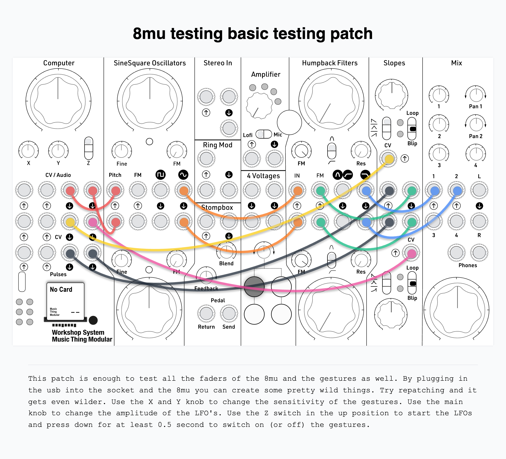

# 8mu CV

*A Music Thing [8mu](https://www.musicthing.co.uk/8mu.html) driving four voltages, two pulses, and an accelerometer.*

8mu CV turns a Music Thing 8mu into a playable front end for the Workshop Computer. Every control the controller has, the eight faders, the four top buttons and the accelerometer, ends up on the Computer's jacks: four voltages and two pulse streams. Arm the LFOs and latch in the accelerometer, and tilting or turning the controller steers levels, rates and widths you did not dial in. That is where the music tends to come from. It is easy to set something in motion and then be surprised by it.

It is also a quick way to test an 8mu channel by channel. It is meant to be used with the 8mu: unplug it and the outputs hold their last values.

## Controls

**Faders**

| Fader | Jack | What it does |
|---|---|---|
| 1 | Audio Out 1 | Voltage, centre 0V (or LFO rate) |
| 2 | Audio Out 2 | Voltage, centre 0V (or LFO rate) |
| 3 | CV Out 1 | Voltage, centre 0V (or LFO rate) |
| 4 | CV Out 2 | Voltage, centre 0V (or LFO rate) |
| 5 | Pulse Out 1 | Rate, 0.1Hz to 20Hz |
| 6 | Pulse Out 2 | Rate, 0.1Hz to 20Hz |
| 7 | Pulse Out 1 | Width, centre is a 50% square |
| 8 | Pulse Out 2 | Width, centre is a 50% square |

**Top buttons**

| Button | Jack | What it does |
|---|---|---|
| 1 (C2) | Audio Out 1 | Arm/disarm its LFO |
| 2 (C3) | Audio Out 2 | Arm/disarm its LFO |
| 3 (C4) | CV Out 1 | Arm/disarm its LFO |
| 4 (C5) | CV Out 2 | Arm/disarm its LFO |

**Switch and panel knobs**

| Control | Job |
|---|---|
| Switch Middle | Basic: faders 1-4 are steady voltages, 5-8 pulse rate and width |
| Switch Up | LFO: armed outputs oscillate |
| Switch Down | Momentary; hold about 0.5s to latch the accelerometer on or off |
| Main | LFO depth |
| X | Gesture sensitivity |
| Y | Gesture smoothing |

The 8mu is the only source of the eight parameters. The panel knobs are not a fallback; each has one job above.

## Patching it

The card is a voltage and pulse source, so it goes wherever those go: oscillator pitch, filter cutoff, VCA level, a wavefolder's bias, clocks and gates.



## Modes

The Computer's switch picks what the card does:

| Switch | Mode | Behaviour |
|---|---|---|
| Middle | Basic | Faders 1-4 are steady voltages, 5-8 pulse rate and width |
| Up | LFO | Armed outputs oscillate; un-armed outputs stay steady voltages |
| Down (momentary) | Latch | Held about half a second, it latches the accelerometer on or off |

Switching back to Middle stops any oscillation, and each output glides to its captured centre rather than jumping.

## The voltages

Each of the four voltage outputs follows its fader from about -5V at the bottom, through 0V in the middle, to about +5V at the top. The audio outputs are DC-coupled on this hardware, so Audio Out 1 and Audio Out 2 carry a steady voltage just as well as sound. That gives four independent voltage sources rather than the usual two from two CV jacks. None of them are calibrated, which does not matter here: this card is a source of control voltages, not a pitch reference.

The level is smoothed a little, so the steps in the 8mu's 7-bit faders do not click into whatever the voltage is controlling.

## LFOs

Any of the four voltage outputs can be a triangle LFO instead of a steady voltage. A tap on one of the top buttons arms that output; it oscillates while the switch is Up. You can arm in Middle and flip Up to hear it.

Arming captures the voltage the output is already sitting at as the centre to swing around. While it is oscillating, the fader that set the level sets the rate instead: 0.1Hz to 20Hz, exponential, the same feel as the pulse rates. So the move is: dial in a voltage, tap the button, flip Up, and it comes alive around that point while your finger takes over the rate.

An output that is not armed is still a steady level even in LFO mode, so the card stays useful with one LFO running, or none.

Main sets how far the triangle swings. Fully anticlockwise is almost no swing, a bare trace; fully clockwise is the whole distance to the nearer supply rail. The swing is measured to the rail, so it scales itself down as the centre gets close to one, and an LFO can never clip. Main only affects armed outputs.

Disarming an output, by tapping its button again or dropping the switch back to Middle, glides it to its centre. The fader does not grab the level back immediately, because it is sitting at a rate position. It stays locked until you move it to meet the captured value, so nothing jumps.

Holding any one of the four buttons for a second and a half disarms all four at once. That is the quick way to stop everything.

Arming survives the 8mu being unplugged, and the mode belongs to the switch, so there is always a way back to steady voltages from the panel.

## The accelerometer

Hold the switch Down for about half a second to latch the accelerometer on or off. All six LEDs blink to confirm. It is off by default. When it is on, the four gesture axes replace the four voltage faders and their LFO rates:

| Axis | Output | Feel |
|---|---|---|
| Pitch | V1 | tilt, back lifted positive; bipolar, rests at 0V / mid rate |
| Roll | V2 | tilt, right lifted positive; bipolar, rests at 0V / mid rate |
| Yaw | V3 | spin, clockwise positive; bipolar (a rate of turn), rests at 0V / mid rate |
| Flip | V4 | which way up; unipolar, flat = 0V / slowest, upside-down = max / fastest |

In Basic the axis sets a steady voltage. In LFO mode an armed output's axis sets its rate instead, replacing the fader. The X knob scales how far the gestures respond, exponential from about 0.25x to 4x. The Y knob smooths them, so a shaky hand does not judder the output. The latch survives the 8mu being unplugged.

## The pulses

Pulse Out 1 and Pulse Out 2 are independent pulse streams. Fader 5 and fader 6 set their rates between 0.1Hz and 20Hz, with an exponential response, so equal movements of the fader multiply the rate by the same amount. That matches the way speed is heard: the bottom of the fader is a slow blink, the top is a fast pulse.

Fader 7 and fader 8 set the width, how much of each cycle the output stays high. The middle of the fader is a 50% square; up widens it, down narrows it.

| Width fader | Duty | Good for |
|---|---|---|
| Bottom (~2%) | very narrow | a sharp trigger or clock edge |
| Middle (50%) | square | the classic LFO / gate shape |
| Top (~98%) | very wide | a gate that holds a note or envelope open nearly all the time |

The width never quite reaches zero or full, so there is always a pulse being produced, never a dead or stuck output. Like the voltages, the width is smoothed slightly, so sweeping the fader does not stretch a single pulse as it passes.

Patch the pulses into clocks, triggers, gates, or anything that wants a rhythmic on/off. At the bottom they are slow enough to use as an LFO; narrow them for triggers and widen them into gates.

## Without a controller

Unplug the 8mu and the outputs simply hold their last values. Nothing new can be set, but nothing jumps either. The switch still selects the mode, so an armed output can still be stopped from the panel. Plug the controller back in and its faders take over again.

## Panel LEDs

| LED | Meaning |
|---|---|
| 0 | Lit while an 8mu is connected |
| 1 | Brightness follows the Audio Out 1 level |
| 2 | Follows Pulse Out 1 |
| 3 | Follows Pulse Out 2 |
| 4 | Lit in LFO mode (switch up) |
| 5 | Brightness follows the CV Out 1 level |

All six blink briefly when the accelerometer latch is toggled.

## Requirements

The 8mu is a USB device, so the Computer has to act as a USB host. This needs a Rev 1.1 or later board, and nothing else may be plugged into the Computer's front USB socket. The card never drives the 8mu's LEDs, so the controller behaves as it does anywhere else.

## Building

```bash
cmake -B build -G Ninja
cmake --build build
```

Drag `build/8mu_cv.uf2` onto the Pico in bootloader mode, or use the binary committed at `UF2/8mu_cv.uf2`.

## Credits

- **Chris Johnson** — the ComputerCard library and `EightMU.h`, which carries the USB MIDI host driver and the TinyUSB host configuration.
- **rppicomidi** — the `usb_midi_host` driver, MIT, vendored inside `EightMU.h`.
- **Tom Whitwell / Music Thing Modular** — the Workshop System and the 8mu.

## License

MIT. See `LICENSE`, which records the vendored components and their terms.
