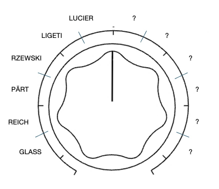
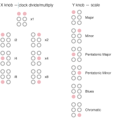

**36 GradualProcess**
====================

By James Saunders

[generative](../../?tag=generative) [sequencer](../../?tag=sequencer) [minimalism](../../?tag=minimalism) [phase](../../?tag=phase) [harmony](../../?tag=harmony) [multi-mode](../../?tag=multi-mode)

GradualProcess is a CV generator that produces sequences in the style of composers Philip Glass, Steve Reich, Arvo Pärt, Frederik Rzewski, György Ligeti and Alvin Lucier. It uses simple algorithms to generate material that draws on these composers’ techniques. The card can cycle through multiple modes and more will be added over time.

## ABOUT

GradualProcess is designed to create pitch sequences and other processes that are governed by composition techniques of a set of composers for whom an aspect is governed by a process. It currently contains six modes:

Glass: generates additive phrases that can be extended or reduced by a short melodic unit and can be doubled at a fifth or played in contrary motion.

Reich: initiates two types of phasing - either a gradual or stepped movement using a newly generated melodic pattern

Pärt: creates a harmonised line using his tintinnabulation technique harmonising pitches strictly using the tonic triad.

Rzewski: generates an accumulating melody similar to *Les Moutons de Panurge*, with pitches being added in the sequence 1, 12, 123, 1234... up to 65, then removing 1234....65, 234...65, 34...65 etc.

Ligeti: generates two voices modeled on his harpsichord piece *Continuum* with fast melodic patterns moving out of phase with each other.

Lucier: applies the feedback process from *I am sitting in a room* using a balanced microphone input and external speaker setup.

Modes 1-5 generate a new pitch sequence each time, drawing on broadly idiomatic types of material appropriate for each composer.

## GENERAL

**MODE SELECT**
This is a multi-process card with different modes chosen by the Main knob's position at power-on (or reset). Main's travel is split into 12 selector slots — the six marked dial divisions, each halved — with room for future processes; the first six slots, CCW to CW, are Glass, Reich, Pärt, Rzewski, Ligeti, and Lucier. LEDs briefly flash to confirm the selection before it starts. The choice latches for that session; to switch, set Main to a different slot and power-cycle/reset again. 

**COMMON CONTROLS**

The first five processes share the same Z-switch convention (Up = Play, Middle = Stop, Down held = Settings), the same 6-scale system (Major, Minor, Pentatonic Major, Pentatonic Minor, Blues, and Chromatic/bespoke) on Y while Z is held, and the same 7-step clock divide/multiply (/8 /4 /2 x1 x2 x4 x8) on X while Z is held. Only the Play-mode controls and outputs differ between them, described per-process below.

Everything works a lot better if you [callibrate the Computer](https://www.musicthing.co.uk/Workshop_System_Calibration/) so the tuning tracks accurately.

Quick reference — controls by mode
-----------------------------------

Main/X/Y do a different job in every mode, and in five of the six modes they do a *second* job while Z is held. This table is a summary, and the full description of each is in that mode's own section below.

| Mode (slot) | Main — Play | Main — Settings (Z held) | X — Play | X — Settings (Z held) | Y — Play | Y — Settings (Z held) |
| :---- | :---- | :---- | :---- | :---- | :---- | :---- |
| **Glass** | Tempo | — | — | Clock divide /8…x8 | Add/remove unit (zone flick) | Scale |
| **Reich** | Tempo | Phrase length, 4–20 beats | Gradual phase drift | Clock divide /8…x8 | Stepped phase shift | Scale |
| **Pärt** | Tempo | Harmonisation type (6 zones) | — | Clock divide /8…x8 | — | Scale |
| **Rzewski** | Tempo | — | — | Clock divide /8…x8 | — | Scale (slot 6 = Scale from Les Moutons de Panurge, not Chromatic) |
| **Ligeti** | Tempo | — | Right-hand loop length | Clock divide /8…x8 | Left-hand loop length | Scale (slot 6 = Interval structures from Continuum, not Chromatic) |
| **Lucier** | Output level, 0–200% | — | Persistence, 0–100% | — | Limiter, off → aggressive | *no settings mode* |

**Z switch** 
Modes 1–5: Up = Play (run), Middle = Stop (halt), Down (hold) = Settings (edit X/Y and, where listed above, Main). 
Mode 6, Lucier, ignores this convention entirely: Z is a plain momentary button, and every *press* (not the switch's resting position) advances a 3-stage cycle — see its own section.

## Modes

### 1. Glass / Additive Process

Glass mode plays a pitch sequence grouped in units of two and three beats, mostly generated through scalic patterns with the occasional leap.

CV 1 plays a melodic line (*Music in Similar Motion*). Try patching it to both oscillators and tuning the second one a fifth higher (*Music in Fifths*).

CV 2 plays a tonal inversion (*Music in Contrary Motion*).

In Play mode, tempo is controlled by the Main knob, modified by the clock divider (Z-down + X).

The Y knob adds or subtracts units in Play mode. Begin at around 12 o'clock. To add a unit, turn it quickly clockwise and return to centre. To subtract a unit, turn it quickly counterclockwise and return to centre. Alternatively, a pulse into Pulse In 2 adds a unit and a pulse into Pulse In 1 removes one.

The LEDs show how many units are present in the loop (1–12).

### 2. Reich / Phasing

Reich mode outputs two identical voices which move out of phase with each other, either gradually or in a single step, generated as groups of two or three pitches with a one-beat rest to separate them.

CV 1 plays a melodic line, newly generated each time the sequence starts. In Settings mode (hold Z down), the Main knob sets the length of the phrase, 4–20 beats. CV 2 doubles the line initially, but can be shifted against CV 1.

In Play mode, tempo is controlled by the Main knob, modified by the clock divider (Z-down + X).

The Y knob shifts the second voice by one beat in either direction. Begin at around 12 o'clock; turn quickly clockwise and return to centre to shift one beat later, counterclockwise and return to shift one beat earlier. The central position holds the current relationship.

The X knob gradually phases the second voice by one beat in either direction. Begin at around 12 o'clock; turn quickly clockwise and return to centre to begin phasing one beat later, reaching the new relationship after roughly 8–16 repeats. Counterclockwise phases one beat earlier the same way. The central position holds the current relationship.

Pulse In 1/2 step the phase back/forward exactly as a Y flick would; CV In 1/2 arm a backward/forward gradual drift exactly as an X flick would — both are live alongside the knobs at all times.

The LEDs show how many beats the second voice has shifted (1–12).

### 3. Pärt / Tintinnabulation

Pärt mode outputs two voices — the melodic voice (m-voice) and the tintinnabulation voice (t-voice), which harmonises it in rhythmic unison. The m-voice moves in stepwise motion with occasional leaps and held notes, and the t-voice adds a harmony pitch from the tonic triad following Pärt's own rules. This mode works best at a slow tempo.

CV 1 plays a melodic line, newly generated each time the sequence starts. CV 2 plays the harmonising line. In Settings mode (hold Z down), the Main knob controls the harmonisation type: from fully counterclockwise and moving clockwise, it selects in order inferior-second, inferior-first, alternating-second, alternating-first, superior-first, superior-second position.

In Play mode, tempo is controlled by the Main knob, modified by the clock divider (Z-down + X).

The X and Y knobs only function in Settings mode, controlling the clock divider (X) and scale selection (Y), as in the other modes.

Pulse Out 1 and 2 send gates sustained for each note's duration, with a brief retrigger blip on every new note.

### 4. Rzewski / Accumulating melody

Rzewski mode models his piece *Les Moutons de Panurge*, generating a random 65-note melody. As in the original piece, it plays note 1, then notes 1–2, then 1–2–3, and so on up to all 65 (the additive half). It then peels notes off the front: 2-3-4...65, then 3-4...65, 4...65 and so on down to the lone final note, which becomes note 1 of a fresh melody, and the process runs on (the subtractive half). 

CV 1 is the main voice. CV 2, Audio 1 (square wave) and Audio 2 (triangle wave) are three further independent readers of the same melody, each of which occasionally slips a whole step in the sequence and mostly stays slipped so all three drift apart from the reference, and from each other, on their own schedule. 

In Play mode, tempo is controlled by the Main knob (5–300 BPM), modified by the clock divider (Z-down + X). Y (Z-down) selects the scale; its sixth slot swaps the usual chromatic for Rzewski's own mode, with an Ab that becomes A natural partway through each melody, matching a detail in the score.

Pulse Out 1 and 2 are a separate rhythmic layer, not tied to any of the four pitch voices' own note-timing — each fires on its own independent one or two beat rhythmic unit. This can trigger percussion to interpret this layer in the original piece. 

The LEDs flash to full on the reference voice's "note 1" and fade across the current sub-phrase, dimmer while the second voice is out of step.

### 5. Ligeti / Phase patterns

Ligeti mode plays two rhythmically-unison voices in contrary motion, after the texture of *Continuum*. Each voice's loop length can be changed to move the cycles out of phase or to align. 

CV/Pulse Out 1 is the right hand, CV/Pulse Out 2 the left. The X knob (right hand) and Y knob (left hand) each independently scrub from a 2-note dyad, through longer scalic runs, to a long up-and-down arc. Set them to match for strict contrary motion, or apart to let the two voices phase against each other as their loop lengths differ.

In Play mode, tempo is controlled by the Main knob (5–300 BPM), modified by the clock divider (Z-down + X or Y). This works better at a very fast tempo as per the original piece. Y (Z-down) selects the scale; its sixth slot replaces chromatic with Ligeti's own structural intervals.

The LEDs show each hand's loop length as a 3-segment bar, left column for the right hand, right column for the left.

### 6. Lucier / Room feedback

Lucier mode is slightly different in its operation. It is not a pitch sequencer but a live acoustic feedback loop, after Alvin Lucier's piece *I am sitting in a room*. Patch a mic through the amplifier into Audio In 1, and Audio Out 1 on to the mixer and send it out to a speaker. A momentary press of Z starts recording. A second press stops recording (whatever was captured becomes the fixed loop length) and starts the loop cycling. It then plays back while simultaneously re-recording whatever the room/mic/speaker chain sends back over the same span. A third press stops everything, ready to start again.

Because every generation is the previous one filtered again through the room, spoken words gradually dissolve and the room's own resonant frequencies build up in their place. The Main, X and Y knobs (Output Level, Persistence, Limiter — see Controls above) are there to shape how quickly and how cleanly that drift happens, without needing to touch the external mixer or amp for every adjustment. As a recommended starting point: get a clean, unclipped signal on the panel LEDs while recording, leave Persistence (X) and the Limiter (Y) around the middle, and adjust from there.

About this card
----------------

| | |
| :---- | :---- |
| Creator | James Saunders |
| Language | C++ (ComputerCard) |
| Version | 1.2.0 |
| Status | Released |
| Created | 2026-07-04 |
| Updated | 2026-09-16 |
