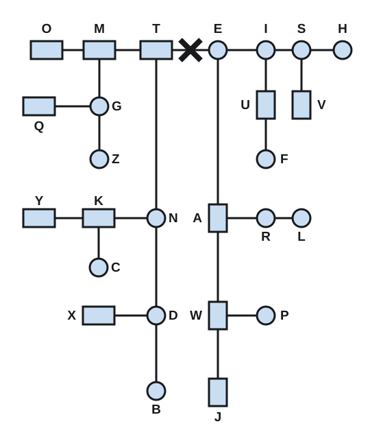

# Dot Dash

A Morse code USB keyboard card for the **Music Thing Modular Workshop Computer**.

Plug a USB keyboard into the Workshop Computer and start typing. Each character
leaves the card as Morse: a beep you can monitor, a gate you can patch, and a
note that turns the whole message into a melody.

*The name comes from Wire's 1978 song
["Dot Dash"](https://genius.com/Wire-dot-dash-lyrics).*

```
DOT   -.. --- -
DASH  -.. .- ... ....
```

## Quick start

1. Flash `dot_dash.uf2`.
2. Plug a USB keyboard into the Workshop Computer.
3. Type. You'll hear beeps on **Audio Out 1** and see **LED 2** light while the
   card transmits.

**Knob X** sets speed, **Knob Y** the beep pitch, **Knob Main** the volume of the
audio outputs. With no keyboard attached the card still runs,
looping `SOS` so you can see it's alive.

## Watch the video

[](https://youtu.be/37OTUfdDDbk)

## What it does

Every output lives on its own jack and they all play at the same time, so patch
the ones you want and ignore the rest. Knob Main is the master level for the two
audio outputs.

- **Audio Out 1** — square-wave beep for each dot and dash.
- **Audio Out 2** — triangle-wave melody voice at the character's pitch, so the
  Morse becomes a tune without any external gear.
- **CV Out 1** — one note per character, climbing with the alphabet: **A** is
  middle C (MIDI 60), then up through Z and the digits 0–9. A dot and a dash
  within one character share that note, so each letter, number, and symbol gets
  its own pitch and a typed word turns into a melody. The note holds through the
  gaps inside a character and its letter gap, then drops to 0 V at a word gap or
  when the card is idle. Uses the card's stored calibration for accurate
  1 V/oct when available and a rough voltage when not, and follows the Transpose
  input.
- **CV Out 2** — transmission speed as a voltage: 0 V at 5 WPM, +5 V at 60 WPM.
- **Pulse Out 1** — gate high for exactly the length of each dot or dash, low in
  the gaps.
- **Pulse Out 2** — short ~2 ms trigger at the start of each dot or dash. Clock
  a sequencer on every symbol.
- **LEDs** — LED 0 lights on dots, LED 1 on dashes, LED 2 while transmitting,
  LED 3 flashes if you over-type the buffer, LED 4 while an external clock is
  driving the card, LED 5 while a keyboard is connected.

With **no keyboard plugged in**, the card loops `SOS` (`... --- ...`) on the
audio, CV and gate outputs and flashes all six LEDs together in that rhythm.
It's alive, just waiting for a keyboard.

## Controls

| Control | Does |
|---------|------|
| **Switch** | Unused. The outputs always play together on their own jacks |
| **Knob Main** | Master audio volume. Fully down is silent; the CV outputs are unaffected |
| **Knob X** | Speed, 5–40 words per minute |
| **Knob Y** | Beep pitch, 300–2000 Hz |
| **CV In 1** | Transpose the notes, 1 V/oct, clamped to ±2 octaves |
| **CV In 2** | Modulate the speed, up to ±20 WPM on top of Knob X; final speed clamped 5–60 WPM |
| **Pulse In 1** | External clock — one rising edge per Morse unit. Overrides Knob X while running |
| **Pulse In 2** | A rising edge clears anything typed but not yet sent |

## Morse timing

The card follows the standard "Paris" timing, where one unit is the length of a
dot and speed is measured in words per minute:

```
dot         = 1 unit
dash        = 3 units
symbol gap  = 1 unit   (between the dots and dashes of one letter)
letter gap  = 3 units
word gap    = 7 units   (letter gap plus 4 more, triggered by the spacebar)
```

The speed is checked every sample, but a dot or dash locks in its length when it
starts. Turn the knob mid-symbol and the one already playing finishes unchanged.

If you patch a clock into **Pulse In 1**, the Morse locks to it instead: every
rising edge advances exactly one unit, so a dot is one clock period, a dash is
three, and the gaps are one, three, and four edges. A swung or irregular clock
bends the timing of the whole message. Knob X is ignored while a clock is
running; the first symbol of a message waits for the next edge, so it lands on
the beat. Pull the cable, or stop the clock for about two seconds, and the card
reverts to the Knob X speed.

## Character pitches

Every letter and digit has its own note, rising in order so the alphabet plays
as an ascending scale:

```
A = middle C (MIDI 60)   B = 61   C = 62   ...   Z = 85
0 = 86  1 = 87  ...  9 = 95
```

A character's dots and dashes sound at that one note. The note is held through
the gaps inside the character and its trailing letter gap, then drops to 0 V at
a word gap or when the card is idle. Punctuation has no note of its own, so it
carries on at the previous character's pitch. The Transpose input shifts the
whole ladder up or down.

## Characters

Letters `A`–`Z`, digits `0`–`9`, the spacebar, and common punctuation
(`. , ? ' / ( ) : ; = - _ " @`). Morse has no upper case, so letters are
case-insensitive. Keys with no Morse meaning (function keys, arrows, Escape, …)
are silently ignored. The buffer holds 64 characters; type faster than the card
sends and the newest key is dropped while LED 3 flashes.

## A little history

Morse code grew out of the electric telegraph, worked out by Samuel Morse and
Alfred Vail in the 1830s and '40s as a way to send letters down a single wire
using nothing but short and long pulses. It became one of the first practical
electric communication systems, and one of the first international standards for
encoding text. The first official message went from Washington to Baltimore on
24 May 1844: *"What hath God wrought?"*

The clever part is that the code isn't arbitrary. Vail counted how often each
letter appeared in a newspaper's type case, then handed the most common letters
the shortest codes. **E** is a single dot, **T** a single dash; rare letters like
**Q** and **J** need four symbols. It's the same idea behind any good input
layout — put the characters you use most where they're quickest to reach. For a
computer, it's also just a binary tree: every dot and dash is a left or right
turn from the root, and the letters you use most sit closest to the top.



The ten digits are all five symbols long (they live one level below the letters
shown here).

## Patching ideas

- Beep or melody into a mixer or effects, gate into an envelope: a talking rhythm.
- Character pitch CV into a VCO and gate into an envelope: typed words play as a melody.
- Transpose CV from a sequencer or keyboard: play the Morse at different pitches.
- Speed CV from an LFO: the transmission breathes faster and slower.
- Pulse Out 2 into a clock input: every dot and dash advances a sequencer.
- Clock in from a sequencer or LFO into Pulse In 1: the Morse plays in time with your patch.
- Leave it unpatched with no keyboard to use it as an SOS beacon.

## Building

The card builds with the Pico SDK and the ComputerCard library. From the repo root:

```sh
./scripts/build.sh releases/505_dot_dash
```

That produces `dot_dash.uf2`, copied next to the source. Hold **BOOTSEL** on the
Workshop Computer, connect USB, release, and copy the `.uf2` to the `RPI-RP2`
drive.

## Notes on the implementation

- **Two cores.** Core 0 runs the TinyUSB host stack and watches for a keyboard.
  Core 1 runs `ComputerCard::Run()`, the 48 kHz audio engine. They talk through a
  small lock-free ring buffer of characters plus a couple of volatile flags, so
  the audio side never blocks waiting on USB.
- **Integer audio path.** All per-sample work (timing, square and triangle
  waves, CV) is `int32_t`/`uint32_t` arithmetic. The RP2040's Cortex-M0+ has no
  floating-point unit and division is slow. The single exception is the melody
  note's frequency, which uses one `exp2f` and only when the note changes, never
  per sample.
- **Caching.** The WPM division, the melody note's phase step, and the beep
  pitch are recomputed only when the relevant knob, input, or character changes,
  keeping the hot path to a few compares.
- **Jack detection.** `EnableNormalisationProbe()` makes unpatched CV/pulse
  inputs read exactly zero, so with nothing plugged in there is no stray
  transposition, speed change, or pause.
- **`PICO_XOSC_STARTUP_DELAY_MULTIPLIER=64`** is set in `CMakeLists.txt`; without
  it the card can fail after a reset. Code is copied to RAM (`copy_to_ram`) to
  remove flash timing jitter from the audio path.

## Licence

MIT. `ComputerCard.h` is © Chris Johnson. TinyUSB configuration adapted from the
ComputerCard `hid_keyboard_mouse` example.
